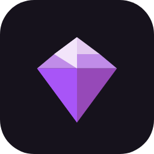

<p align="center">
  
</p>

<h1 align="center">Amethyst X</h1>

<p align="center">
  <b>Minecraft: Java Edition on Android, in a launcher that was designed rather than assembled.</b>
</p>

<p align="center">
  <a href="https://github.com/pokitw/Amethyst-Android/actions"></a>
  <a href="LICENSE"></a>
  
</p>

---

Amethyst X runs a real JVM on your phone and translates the game's OpenGL calls to OpenGL ES, so
it is a launcher and a compatibility layer at once. It is a fork of
[Amethyst](https://github.com/AngelAuraMC/Amethyst-Android), which is itself a fork of
[PojavLauncher](https://github.com/PojavLauncherTeam/PojavLauncher).

Two things separate it from upstream.

**A gameplay recorder that captures inside the GL pipeline** rather than through the screen, so it
records the game and nothing else. No control buttons, no notifications, no system bars. The
recorder was offered upstream and declined, and that refusal is the origin of this fork: rather
than maintain a patch, make it a better tool.

**A ground-up interface redesign in Jetpack Compose**, aimed at flagship Android app quality.
Nearly every screen has been rewritten, from the home screen to the crash report, and each was
designed against what people actually do rather than converted from the layout that happened to
exist.

## Contents

* [What Amethyst X adds](#what-amethyst-x-adds)
* [Compared to upstream](#compared-to-upstream)
* [Getting Amethyst X](#getting-amethyst-x)
* [Building](#building)
* [Design principles](#design-principles)
* [Known limitations](#known-limitations)
* [Contributing](#contributing)
* [License](#license)
* [Credits and dependencies](#credits-and-dependencies)

## What Amethyst X adds

### Recording and screenshots

The recorder hooks the frame just before it is presented, sharing a second GL context with the
game and blitting into a hardware encoder surface. That is roughly one extra full-screen blit and
a hardware encode per frame, far cheaper than a screen recorder, which composites the whole
display and re-encodes it.

* Records the game framebuffer, so overlays and system UI never appear in the output
* Game audio via playback capture, optionally mixed with the microphone
* A JSON sidecar next to each clip recording version, resolution, frame rate and audio
* **In-game screenshots** taken at the same seam, so the controls are not in the picture, with a
  draggable floating shutter or a tap in the control center
* Clips and screenshots are copied to an **Amethyst X album** in your gallery, because everything
  the launcher writes lives under `Android/data`, which no gallery or share sheet can see

### Controls

* **In-game control center**, a sheet from the bottom where thumbs already are, with recording as
  the card at the top
* **On-screen keyboard** built for the game, replacing the keycode dialog. Any key can be latched
  by long press, which is the only way F3 + G was ever reachable
* **Voice typing** straight into chat, through the bound speech recogniser so the game never pauses
* **Typing preview**, a strip at the top showing what you have typed, because the pan that lifts a
  text field clear of the keyboard pushes it off a short landscape screen instead
* **Rewritten layout editor**: bind a key by pressing it on a keyboard rather than picking a
  keycode from a spinner, edit live on the button behind the panel, arrange over a bright preview
  world so you can see whether a translucent button will still be legible
* **Button texture packs**, eleven shipped, plus an importer and an exporter for making your own
* **A ready-made Bedrock layout**, joystick left and the staggered action cluster right
* **Timed key sequences**: one button fires its keys in order a tick or more apart, which is how a
  pearl then wind charge move actually works
* **Slide to repeat**: tap for one press, hold and slide to keep it firing, so one button both
  places a block and clutches
* **Joystick auto-walk**: double-tap a direction to keep walking without holding the stick, touch
  it again to take control back
* **Gyro aiming rewritten** to read raw angular velocity in player space at 1:1, replacing an
  implementation that held movement behind a threshold and then jumped

### Getting the game to run well

* **Turnip driver manager** for importing adrenotools Vulkan drivers on Adreno devices
* **Crash diagnosis** that reads the log and names the failure in words, quoting the line it
  concluded from, instead of handing you a stack trace
* **The log, readable in the app**, with search, a level filter and a tap from a result to that
  line in context. Everything the launcher writes lives under `Android/data`, which from
  Android 11 cannot be browsed to, so sharing it out was the only way to read your own log

### Content, without leaving the app

* **Game files**: worlds, mods, resource packs, shader packs and screenshots on one screen. The add
  button takes any file and works out where it goes from what it is
* **Mod browser** searching Modrinth, filtered to your profile's Minecraft version and loader
  before you type a character, with required dependencies resolved
* **Loader installer** for Fabric, Quilt, Forge and NeoForge, asked from the Minecraft version
  rather than from the loader, so you can see which loaders support a version before choosing one
* **Skin editor** with a live software-rendered model, plus a lookup for any player's skin through
  Mojang's own public API

### Everywhere else

* Settings grouped by intent, each destination carrying a live summary of its own state, and a
  search that scrolls to the row it found and lights it up
* An onboarding flow that ends in an honest side-by-side against upstream, including the rows
  where this fork loses
* Dark only, one accent, no dynamic colour. The amethyst is the brand and does not get replaced by
  your wallpaper

## Compared to upstream

This is the same table the app shows on first run, measured against the fork point. It is only
worth reading because it loses rows.

| | Amethyst | Amethyst X |
| --- | :---: | :---: |
| Plays Minecraft: Java Edition | Yes | Yes |
| Built-in gameplay recorder | No | Yes |
| Smooth gyro aiming | Part | Yes |
| Voice typing in chat | No | Yes |
| On-screen keyboard | No | Yes |
| See what you are typing | No | Yes |
| Worlds and mods in the app | No | Yes |
| Install mods in the app | Part | Yes |
| Crash cause explained | No | Yes |
| Searchable log in the app | Part | Yes |
| Searchable settings | No | Yes |
| Redesigned controls | Part | Yes |
| Button texture packs | No | Yes |
| Ready-made Bedrock layout | Part | Yes |
| Timed key sequences | Part | Yes |
| Slide a button into repeating | No | Yes |
| Lock the joystick into walking | No | Yes |
| Import Vulkan drivers | Part | Yes |
| Skin editor | No | Yes |
| Look up any player's skin | No | Yes |
| Install any loader from one screen | Part | Yes |
| Smaller download | Yes | Part |

"Part" means upstream has something that answers the same question less completely. Gyro aiming is
the clearest example: upstream has one, and it steps.

## Getting Amethyst X

Builds come from CI, one per push.

1. Open [the Actions tab](https://github.com/pokitw/Amethyst-Android/actions) and pick the most
   recent green run.
2. Download the **app-debug (recommended)** artifact and install the APK inside it.

GitHub only lets signed-in users download artifacts. If you would rather not sign in,
[nightly.link](https://nightly.link/pokitw/Amethyst-Android) mirrors the same files with no account
needed.

Requires **Android 5.0 or later**.

One thing worth knowing before you install. CI publishes a **debug** build, and debug builds carry
a `.debug` suffix on the application ID. That means the artifact above installs beside an existing
Amethyst rather than over it, and keeps its own game folder at
`Android/data/org.angelauramc.amethyst.debug/files`, so worlds and versions from another install
will not appear in it. A release build keeps the plain `org.angelauramc.amethyst` that upstream
Amethyst uses, and upgrades one in place. That ID has deliberately never been changed, because it
is what decides where the game folder lives.

## Building

There is no Android SDK requirement beyond the usual. The submodules matter.

```bash
git clone --recursive https://github.com/pokitw/Amethyst-Android.git
cd Amethyst-Android
./gradlew :app_pojavlauncher:assembleDebug
```

The APK lands in `app_pojavlauncher/build/outputs/apk/debug/`. Use `gradlew.bat` on Windows.

<details>
<summary>Building the runtime and native pieces yourself</summary>

The quick build above uses the pre-built JREs that CI provides. If you want to build them:

1. **Java runtime.** Download the `jre8-pojav` artifact from the
   [openjdk-build-multiarch CI](https://github.com/AngelAuraMC/openjdk-build-multiarch/actions),
   which contains pre-built JREs for every supported architecture. To build it yourself, follow
   the instructions in that repository.
2. **LWJGL.** Build instructions live in the [LWJGL repository](https://github.com/AngelAuraMC/lwjgl3).
3. **Language list.** Languages are added automatically by Crowdin, so the list has to be
   regenerated before building:
   * Linux and macOS: `bash scripts/languagelist_updater.sh`
   * Windows: `scripts\languagelist_updater.bat`
4. **GLFW stub:** `./gradlew :jre_lwjgl3glfw:build`
5. **Launcher:** `./gradlew :app_pojavlauncher:assembleDebug`

</details>

### Verification

There is no device in CI, so anything that can be checked without one is checked by a script in
[`scripts/`](scripts/). Each harness drives the shipped source rather than a copy of it: control
layouts are evaluated across a grid of screen sizes and button scales, the Modrinth and Mojang
parsers run against fixtures, the skin atlas is checked against independent ground truth, and the
gyro maths is compiled and fed synthetic motion. Every harness is mutation-tested: the shipped
code is broken on purpose to prove the check fails, which is how the log parser's first harness
was found to be driving a copy of the algorithm rather than the algorithm. `CLAUDE.md` lists
which to run when.

## Design principles

The full handbook is in [`CLAUDE.md`](CLAUDE.md), which is the source of truth for why this
project is built the way it is. The short version:

* **Rank by what people actually do, not by what the code contains.** The old home screen gave the
  account bar, set once and then ignored for months, the largest element on the screen, while Play
  sat at the bottom sharing weight with a version dropdown.
* **Merge decisions that are really one decision.** Nobody thinks "select 1.20.1" and then
  separately "launch". Version and Play are one object.
* **Show state before the action, not after the failure.** The launch card names the renderer,
  memory, mod loader and whether the version is downloaded, so a profile on the wrong renderer is
  visible before it fails.
* **Spend boldness in one place.** Exactly one element per screen carries a gradient.
* **Destructive actions do not get prime real estate.** Force close used to be the first row of the
  in-game menu.
* **Minecraft personality, not a Minecraft costume.** Inventory-slot geometry for icon wells,
  slightly chunkier proportions than stock Material, and no pixel-art chrome anywhere.

## Known limitations

Stated rather than discovered. [`CLAUDE.md`](CLAUDE.md) carries the full list.

* **Zink cannot be recorded.** It renders through OSMesa, which has no EGL surface to hook. It
  can still be screenshotted, because OSMesa leaves a finished frame in memory.
* Recordings are capped below 4 GB, the MP4 32-bit offset limit, which is roughly 40 minutes at
  1080p60. Automatic segmentation is designed but not built.
* The gallery copy doubles the space a clip takes, and is skipped when the volume is short.
* Three settings leaves are still the old preference screens: the runtime manager, the gamepad
  remapper and the MobileGlues tuning. Settings search does not index them.
* The on-screen keyboard is US layout, because that is what the game's own keybind names assume.
* Voice typing quality is your device's recogniser, and it cannot open chat for you, since nothing
  on the launcher side can read your keybinds.
* Skin history is the launcher's own record. Mojang does not keep one and never has.
* There is no browsable skin catalogue, because there is no licensed API for one. What is offered
  instead is Mojang's public lookup, a player at a time.
* Release builds do not run R8, so every dependency ships whole. That is the "smaller download"
  row in the table above.

## Contributing

Issues and pull requests are welcome on [this repository](https://github.com/pokitw/Amethyst-Android/issues).

Before changing anything, read [`CLAUDE.md`](CLAUDE.md). It is not a style guide, it is a record of
which decisions are load-bearing and which mistakes have already been made and paid for. Section 12
lists the things that must not change without a very good reason, and section 16 lists the bugs
that cost a build cycle each.

For upstream Amethyst, see its [wiki](https://wiki.angelauramc.dev) and
[Discord](https://discord.gg/5ptqkyZxEy). Those are upstream's channels, not this fork's.
Translations go through upstream's [Crowdin](https://crowdin.com/project/pojavlauncher).

## License

[GNU LGPLv3](LICENSE), inherited from PojavLauncher and Amethyst.

## Credits and dependencies

Amethyst X exists because of the work below. The launcher is a thin thing sitting on top of a very
large amount of other people's engineering.

* [Boardwalk](https://github.com/zhuowei/Boardwalk) (JVM launcher): Unknown License / [Apache License 2.0](https://github.com/zhuowei/Boardwalk/blob/master/LICENSE) or GNU GPLv2
* [PojavLauncher](https://github.com/PojavLauncherTeam/PojavLauncher): [GLGPL](https://github.com/PojavLauncherTeam/PojavLauncher/blob/v3_openjdk/LICENSE)
* [Amethyst](https://github.com/AngelAuraMC/Amethyst-Android) by AngelAuraMC, the direct upstream
* Android Support Libraries: [Apache License 2.0](https://android.googlesource.com/platform/prebuilts/maven_repo/android/+/master/NOTICE.txt)
* [GL4ES](https://github.com/AngelAuraMC/gl4es): [MIT License](https://github.com/ptitSeb/gl4es/blob/master/LICENSE)
* [MobileGlues](https://github.com/MobileGL-Dev/MobileGlues): [LGPL-2.1 License](https://github.com/MobileGL-Dev/MobileGlues/blob/dev-es/LICENSE)
* [Krypton Wrapper](https://github.com/BZLZHH/NG-GL4ES): [MIT License](https://github.com/BZLZHH/NG-GL4ES/blob/main/LICENSE)
* [ANGLE](https://chromium.googlesource.com/angle/angle): [All Rights Reserved](app_pojavlauncher/src/main/assets/licenses/ANGLE_LICENSE)
* [OpenJDK](https://github.com/AngelAuraMC/openjdk-multiarch-jdk8u): [GNU GPLv2 License](https://openjdk.java.net/legal/gplv2+ce.html)
* [LWJGL3](https://github.com/AngelAuraMC/lwjgl3): [BSD-3 License](https://github.com/LWJGL/lwjgl3/blob/master/LICENSE.md)
* [LWJGLX](https://github.com/AngelAuraMC/lwjglx) (LWJGL2 API compatibility layer for LWJGL3): unknown license
* [Mesa 3D Graphics Library](https://gitlab.freedesktop.org/mesa/mesa): [MIT License](https://docs.mesa3d.org/license.html)
* [bhook](https://github.com/bytedance/bhook) (exit code trapping): [MIT license](https://github.com/bytedance/bhook/blob/main/LICENSE)
* [libepoxy](https://github.com/anholt/libepoxy): [MIT License](https://github.com/anholt/libepoxy/blob/master/COPYING)
* [virglrenderer](https://github.com/AngelAuraMC/virglrenderer): [MIT License](https://gitlab.freedesktop.org/virgl/virglrenderer/-/blob/master/COPYING)
* [OpenAL-Soft](https://github.com/kcat/openal-soft): [GNU GPLv2](https://github.com/kcat/openal-soft/blob/master/COPYING)
  * [oboe](https://github.com/google/oboe): [Apache License 2.0](https://github.com/google/oboe/blob/main/LICENSE)
  * [pffft](https://bitbucket.org/jpommier/pffft/src/master/): [ARR](https://bitbucket.org/jpommier/pffft/src/master/pffft.h)
* [SDL3](https://github.com/libsdl-org/SDL): [zlib License](https://github.com/libsdl-org/SDL/blob/main/LICENSE.txt)
* [sdl2-compat](https://github.com/libsdl-org/sdl2-compat): [zlib License](https://github.com/libsdl-org/sdl2-compat/blob/main/LICENSE.txt)
* [Modrinth](https://modrinth.com) for the mod index, and Mojang for the public profile API
* Thanks to [MCHeads](https://mc-heads.net) for providing Minecraft avatars

Amethyst X is not affiliated with Mojang, Microsoft or Minecraft.
